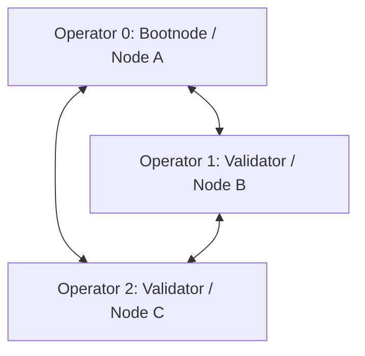

# Qanto Cohort A Rehearsal Playbook

This playbook outlines the step-by-step coordination runbook for the **3-node Cohort A Rehearsal** to verify the network's operational survivability and prepare for Gate C opening.

---

## 1. Objectives

- **Multi-Operator Coordination**: 3 independent operators build, sync, and validate blocks on separate physical systems.
- **Bootnode Recovery**: Validate that peer nodes successfully reconnect using exponential backoff and resume consensus after a bootnode restart.
- **Consensus Health**: Confirm telemetry collection and NOC dashboard visualization of GHOST canonical TPS and heights.

---

## 2. Participant Pre-Requisites

Each of the 3 operators requires:
- **System**: Linux (Ubuntu 22.04/24.04 recommended) or macOS.
- **Hardware**: Minimum 4-core CPU, 16 GB RAM, 100 GB NVMe SSD.
- **Network**: Standard internet access. Operator 0 (Bootnode) **MUST** have port `30303` forwarded and open to accept incoming P2P connections.

---

## 3. Rehearsal Execution Steps

### Step 1: Compile the Code
Clone the repository and compile the release binaries:
```bash
git clone https://github.com/qanto-org/qanto.git
cd qanto
cargo build --release
```
Confirm the binaries exist:
- Node daemon: `./target/release/qanto`
- Wallet: `./target/release/qantowallet`

---

### Step 2: Generate Validator Identity & Keys
Each validator requires a separate, unique wallet. Generate it headlessly:
```bash
# Set your password in env or let it prompt
export WALLET_PASSWORD="your-strong-password"
./target/release/generate_wallet --output wallet.key
```
Show the public address:
```bash
./target/release/qantowallet show --wallet wallet.key
```
Save your address (e.g. `0x1234...abcd`) to share with the cohort.

---

### Step 3: P2P Network Configuration

The cohort will connect in a hub-and-spoke P2P network around Operator 0 (Bootnode).



1. **Operator 0 (Bootnode / Node A)**:
   - Listen address: `/ip4/0.0.0.0/tcp/30303/ws`
   - Share your public IP and P2P identity multiaddress with the other two operators.
2. **Operators 1 & 2 (Validators / Node B & C)**:
   - Configure your peer list to point to Operator 0's P2P address:
     `peers = ["/ip4/<bootnode-public-ip>/tcp/30303/ws"]`

---

### Step 4: Staking & Validator Registration
To be recognized by consensus, each operator must stake a minimum of **10,000 QNTO** (represented as `10000000000000` base units in fixed-point 9 decimals).
Submit a staking transaction:
```bash
./target/release/qantowallet send --wallet wallet.key 9f00000000000000000000000000000000000011000000000000000000000000 10000000000000
```

---

### Step 5: Start Node Services
Start the nodes in validator mode:
```bash
./target/release/qanto start --config config.toml --mine
```

---

### Step 6: Verify Telemetry & Consensus Sync
Check the local node stats:
```bash
curl -s http://127.0.0.1:8081/stats
```
Verify that:
- `block_count` is increasing (consensus is advancing).
- `peer_count` is $\ge 2$ (fully connected).
- Local block hashes match across all nodes.

---

## 4. Forced Outage & Recovery Drills

During the rehearsal, the cohort will execute two operational failure recovery drills:

### Drill 1: Bootnode Outage Recovery
1. **Trigger**: Operator 0 stops their bootnode process for 5 minutes.
2. **Observe**: Operators 1 & 2 must log P2P disconnection and backoff reconnection attempts.
3. **Recovery**: Operator 0 restarts the bootnode. Operators 1 & 2 must automatically reconnect and resume syncing/block validation.

### Drill 2: Validator Node Catch-up
1. **Trigger**: Operator 1 kills their node process via `SIGTERM`.
2. **Drift**: Let the remaining nodes mine blocks for 5 minutes.
3. **Recovery**: Operator 1 restarts their node. The node must perform WAL recovery, sync the missed block interval from Operators 0 & 2, and catch up to the current block height.

---

## 5. Gate C Verification Criteria

To successfully pass the Cohort A Rehearsal and unlock **Gate C**, the cohort must satisfy the following:
1. **Successful Rehearsal Pass**: All 3 operators complete the outage recovery drills without issues.
2. **All Nodes Recovery**: All participating validator nodes must successfully reconnect and recover consensus sync after the bootnode is restarted.
3. **Zero Chain Forks**: No nodes report inconsistent block heights or state divergence post-recovery.

