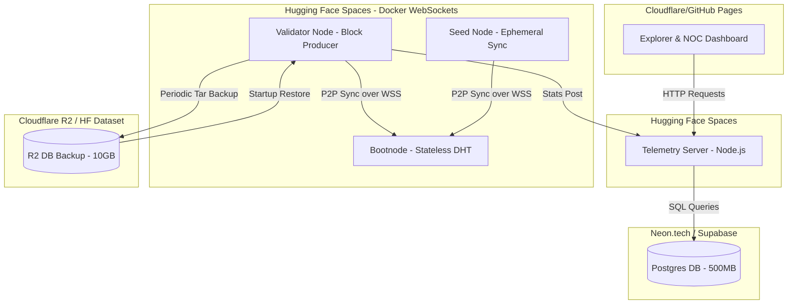

# Qanto Free Testnet Architecture (Zero-Budget Specification)

This document specifies a sustainable, production-grade infrastructure architecture for the Qanto Genesis Testnet operating under a strict **$0/month budget constraint**. It leverages free-tier hosting, serverless databases, static front-ends, and cloud object storage, utilizing WebSockets for peer-to-peer network discovery.

---

## 1. Infrastructure Inventory

We will utilize the following permanently free tiers:

1.  **Hugging Face Spaces (Free Tier)**
    *   **Spec**: 16 GB RAM, 2 vCPU, 50 GB Ephemeral Storage, Outbound Networking.
    *   **Traffic**: Standard HTTPS/WSS (WebSockets) exposed on port 8081 (proxied via port 443).
    *   **Persistence**: Ephemeral (reset on container restart/redeploy).
2.  **Neon.tech (Free Tier)**
    *   **Spec**: 1 Shared Postgres Instance, 0.5 GB Storage, pooled connections.
    *   **Persistence**: Fully Persistent.
3.  **Cloudflare Pages & GitHub Pages (Free Tier)**
    *   **Spec**: Unlimited bandwidth, free static site hosting, automatic SSL.
    *   **Persistence**: Read-only static deployment.
4.  **Cloudflare R2 (Free Tier)**
    *   **Spec**: 10 GB persistent object storage, $0 egress fees.
    *   **Persistence**: Fully Persistent.
5.  **UptimeRobot / Cron pinger (Free Tier)**
    *   **Spec**: HTTP pings every 5–10 minutes.
    *   **Purpose**: Keep Hugging Face containers awake.

---

## 2. Hosting Matrix

| Provider & Service | 24/7 Capable? | Persistent Storage? | Outbound Network? | P2P Compatible? | Validator Compatible? | Bootnode Compatible? |
| :--- | :--- | :--- | :--- | :--- | :--- | :--- |
| **Hugging Face Spaces** | Yes (With ping) | No (Ephemeral) | Yes (Unrestricted) | Yes (WebSocket Only) | Yes (With R2 Backup) | Yes (Stateless DHT) |
| **Neon.tech (Postgres)**| Yes | Yes | N/A | No (Database only) | N/A | N/A |
| **Cloudflare R2** | Yes | Yes | N/A | No (Object storage) | N/A | N/A |
| **Cloudflare Pages** | Yes | Yes (Static) | N/A | No (Static frontend) | N/A | N/A |
| **Vercel / GitHub Pages**| Yes | Yes (Static) | N/A | No (Static frontend) | N/A | N/A |

---

## 3. Component Architecture & Deployment Strategy

### A. The Bootnode & Seed Node (Stateless P2P)
*   **Hosting**: Hugging Face Spaces (Docker Space running Qanto compiled with WebSocket transport).
*   **P2P Configuration**: Listening on port `8081` for WebSocket connections.
*   **Address**: `/dns4/qanto-bootnode.hf.space/tcp/443/wss/p2p/<PeerId>`
*   **State**: The bootnode runs in stateless bootstrap-only mode, maintaining a Kademlia DHT routing table but no block store. If the Space restarts, it simply reconstructs its routing table as peers reconnect.
*   **Keep-Alive**: Kept active using UptimeRobot sending requests to a lightweight health endpoint.

### B. The Validator Node (Stateful P2P)
*   **Hosting**: Hugging Face Spaces (Docker Space running Qanto validator).
*   **P2P Connection**: Connects to the Bootnode via WebSockets.
*   **Persistence Workaround (R2 Sync)**:
    Since Hugging Face storage is ephemeral, the Docker container runs a startup wrapper script:
    1.  **On Startup**: Uses `rclone` or AWS CLI to fetch the latest compressed blockchain database `qanto_db.tar.gz` from Cloudflare R2 (or a Hugging Face Dataset) and extracts it to `/data/db`.
    2.  **During Operation**: A background cron/script runs every 20 minutes, compresses the current active database segment, and uploads the segment to R2.
    3.  **On Shutdown**: The container traps the SIGTERM signal, flushes the LSM-tree/WAL database, runs a final compression, uploads to R2, and exits.
*   **Automated consensus simulation**: Multiple identical Space instances can be spun up as separate mock validators under different keys to simulate a multi-node PoW/PoS consensus loop at $0 cost.

### C. The Telemetry Server
*   **Hosting**: Render (Free Tier) or Hugging Face Spaces (Docker space running Node.js express server).
*   **Database**: Neon.tech or Supabase Free Tier Postgres database (via `DATABASE_URL` environment variable).
*   **State**: Metrics are safely stored in Postgres, ensuring history and active alerts are not lost when the Telemetry Server restarts.
*   **Keep-Alive**: Kept active using UptimeRobot.

### D. Explorer & NOC Dashboard
*   **Hosting**: GitHub Pages or Cloudflare Pages.
*   **Nature**: Completely static HTML/JS files (`status.html`), reading dynamically from the Telemetry Server endpoint via HTTPS requests.

---

## 4. Operational Recovery Plan (Laptop Offline Scenario)

Because the bootnode, seed, validator, database, and telemetry are hosted 24/7 on Hugging Face and Cloudflare, the network **remains fully active when the founder laptop is offline/sleeping**. 

*   **Block Production**: The automated validator Space on Hugging Face produces blocks.
*   **Syncing**: Any new nodes can dial the HF Bootnode and sync blocks from the HF Seed Node.
*   **Telemetry**: Metrics are logged and alerts dispatched without laptop dependency.
*   **Recovery**: If a validator space crashes, the Hugging Face manager automatically spawns a new instance. The startup script pulls the last 20-minute DB checkpoint from R2 and resumes mining immediately.
