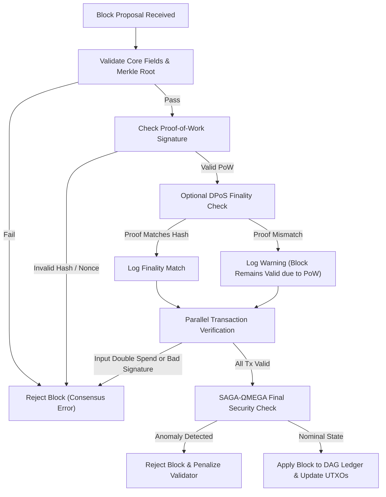
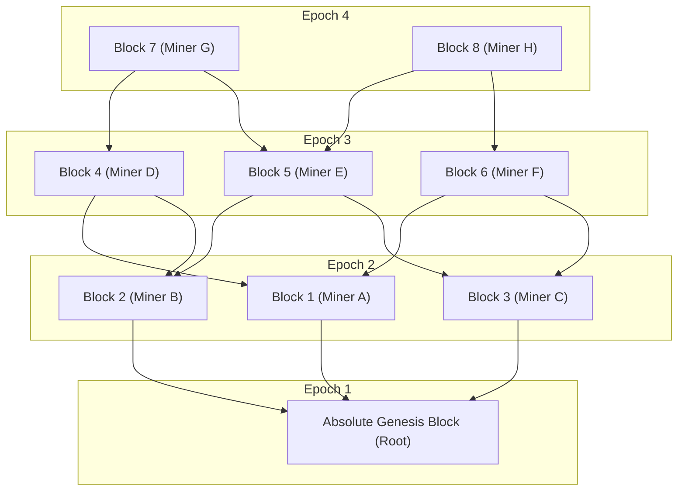
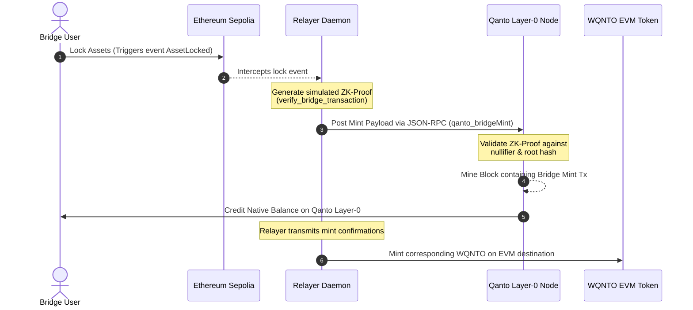
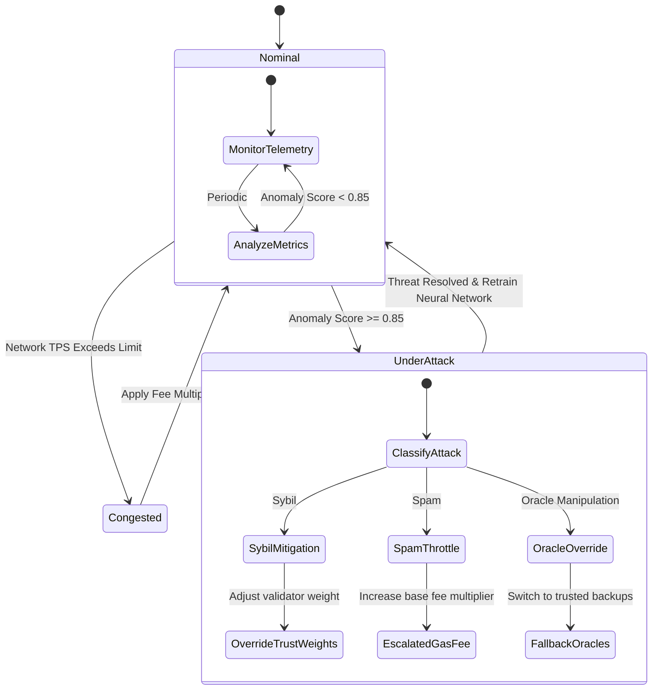

# QANTO Layer-0 Protocol: System Architecture & Technical Overview

Welcome to the comprehensive technical documentation and system overview of **QANTO** — the world’s first post-quantum, AI-governed Layer-0 blockchain infrastructure. 

This document provides a system-wide analysis of the Qanto codebase, structured across three core perspectives: **Software Architecture**, **Software Development**, and **Product Management**.

---

## Table of Contents
1. [System Architecture (Architect's Perspective)](#1-system-architecture-architects-perspective)
   - [Hybrid Consensus (PoW + DPoS + PoSe + SAGA)](#hybrid-consensus-pow--dpos--pose--saga)
   - [Synaptic DAG Ledger & Hyper-Sharding](#synaptic-dag-ledger--hyper-sharding)
   - [Cross-Chain Relayer Topology](#cross-chain-relayer-topology)
2. [Codebase & Implementation (Developer's Perspective)](#2-codebase--implementation-developers-perspective)
   - [Repository Layout & Module Mapping](#repository-layout--module-mapping)
   - [GPU Hashing & Cryptographic Kernels](#gpu-hashing--cryptographic-kernels)
   - [Core Rust Performance Optimizations](#core-rust-performance-optimizations)
   - [Smart Contract Ecosystem (EVM Suite)](#smart-contract-ecosystem-evm-suite)
   - [Testing & Quality Assurance Suite](#testing--quality-assurance-suite)
3. [Product & Economics (Product Manager's Perspective)](#3-product--economics-product-managers-perspective)
   - [Core Tokenomics & Mathematical Seals](#core-tokenomics--mathematical-seals)
   - [Deflationary Asymptotic Emission Curve](#deflationary-asymptotic-emission-curve)
   - [Green Mining & Carbon-Neutral Incentive Alignment](#green-mining--carbon-neutral-incentive-alignment)
   - [Competitive Matrix vs. Industry Alternatives](#competitive-matrix-vs-industry-alternatives)
4. [Architectural Visualizations (Mermaid Diagrams)](#4-architectural-visualizations-mermaid-diagrams)
   - [Hybrid Consensus & Validation Workflow](#hybrid-consensus--validation-workflow)
   - [Synaptic DAG Structure & Block Linking](#synaptic-dag-structure--block-linking)
   - [Cross-Chain Bridge Lock & Mint Pipeline](#cross-chain-bridge-lock--mint-pipeline)
   - [SAGA AI Governance State Machine](#saga-ai-governance-state-machine)
5. [Actionable Insights & Development Roadmap](#5-actionable-insights--development-roadmap)

---

## 1. System Architecture (Architect's Perspective)

QANTO is designed as a modular Layer-0 protocol focused on high throughput, post-quantum security, and autonomic governance. 

```
┌────────────────────────────────────────────────────────────────────────┐
│                          Application Layer                             │
│       dApp Portal / QantoWallet / EVM AMMs / Carbon Credit Registry    │
└───────────────────────────────────┬────────────────────────────────────┘
                                    │ gRPC / JSON-RPC
┌───────────────────────────────────▼────────────────────────────────────┐
│                        Protocol Core (Layer-0)                         │
│   ┌────────────────────────────────────────────────────────────────┐   │
│   │                        Consensus Engine                        │   │
│   │          PoW Leader Election  +  DPoS Byzantine Finality       │   │
│   └────────────────────────────────┬───────────────────────────────┘   │
│                                    │ Block Link / Validate             │
│   ┌────────────────────────────────▼───────────────────────────────┐   │
│   │                      Synaptic DAG Ledger                       │   │
│   │            Topological Sorting  +  Linearized Shards           │   │
│   └────────────────────────────────┬───────────────────────────────┘   │
│                                    │ State Transitions                 │
│   ┌────────────────────────────────▼───────────────────────────────┐   │
│   │                      SAGA AI Governance                        │   │
│   │            Anomalous Threat Mitigation & Auto-Scaling          │   │
│   └────────────────────────────────────────────────────────────────┘   │
└───────────────────────────────────┬────────────────────────────────────┘
                                    │ P2P Mesh Gossip
┌───────────────────────────────────▼────────────────────────────────────┐
│                          Cryptographic Core                            │
│      Dilithium Signatures  +  Kyber Key Exchange  +  Qanhash GPU       │
└────────────────────────────────────────────────────────────────────────┘
```

### Hybrid Consensus (PoW + DPoS + PoSe + SAGA)
Unlike traditional single-mechanism blockchains, Qanto combines four distinct layers of validation to balance security, speed, and decentralization:
*   **Proof-of-Work (PoW)**: Serves as the primary mechanism for permissionless leader election. Nodes execute a custom ASIC-resistant hashing algorithm (`Qanhash`) to mine blocks. It represents the "Primary Finality" that protects the network against spam and Sybil control.
*   **Delegated Proof-of-Stake (DPoS)**: Serves as the "Finality Helper." Registered validators verify block headers and sign finality proofs to enable sub-second settlement. If DPoS fails or shows a mismatch, the block is still valid based on its mathematical PoW proof, avoiding single-point-of-failure lockouts.
*   **Proof-of-Storage/Execution (PoSe)**: Validates that nodes are dedicating physical storage and execution capacity, preventing lazy staking.
*   **SAGA (Sentient Autonomous Governance Algorithm)**: SAGA operates as an autonomous AI-directed governor that monitors real-time telemetry (TPS, memory pool, network latencies) and generates network-level **Edicts**. SAGA adjusts block sizes, priority fee multipliers, and difficulty targets dynamically.

### Synaptic DAG Ledger & Hyper-Sharding
Instead of a single linear chain, Qanto arranges block headers in a **Directed Acyclic Graph (DAG)** structure (the Synaptic DAG):
*   Blocks reference multiple parent blocks instead of a single predecessor. This eliminates fork-choice delays and lets validators produce blocks concurrently.
*   **Topological Linearization**: Blocks are ordered topologically by height and timestamp to ensure deterministic state transitions.
*   **Hyper-Sharding**: The ledger splits transactions into parallel shards when transaction activity exceeds baseline limits. As shards scale, execution scales linearly, aiming for a throughput target of **10M+ TPS**.

### Cross-Chain Relayer Topology
Interoperability is native to the Layer-0 kernel. The **Qanto Relayer Daemon** maps states across chains (such as Ethereum Sepolia and Qanto). 
1.  An asset lock is initiated on the EVM host chain.
2.  The Relayer intercepts the event, generates a zero-knowledge proof of transaction inclusion, and broadcasts it to the Qanto RPC.
3.  The Qanto node validates the ZK proof within its consensus cycle and mints wrapped assets (e.g., `WQNTO`) directly on the destination ledger.

---

## 2. Codebase & Implementation (Developer's Perspective)

### Repository Layout & Module Mapping
The repository is structured as a Rust virtual workspace, alongside EVM Solidity contracts and web frontends:

*   **`Protocol_Core/`**:
    *   [qanto-node](file:///Users/trvorth/qanto/Protocol_Core/qanto-node): The main Rust node orchestrator. It manages the mempool ([mempool.rs](file:///Users/trvorth/qanto/Protocol_Core/qanto-node/src/mempool.rs)), miner loops ([miner.rs](file:///Users/trvorth/qanto/Protocol_Core/qanto-node/src/miner.rs)), hybrid consensus ([consensus.rs](file:///Users/trvorth/qanto/Protocol_Core/qanto-node/src/consensus.rs)), AI governance ([saga.rs](file:///Users/trvorth/qanto/Protocol_Core/qanto-node/src/saga.rs)), and networking ([p2p.rs](file:///Users/trvorth/qanto/Protocol_Core/qanto-node/src/p2p.rs)).
    *   [qanto-core](file:///Users/trvorth/qanto/Protocol_Core/qanto-core): Basic crypto primitives ([qanto_native_crypto.rs](file:///Users/trvorth/qanto/Protocol_Core/qanto-core/src/qanto_native_crypto.rs)), serialization protocols ([qanto_serde.rs](file:///Users/trvorth/qanto/Protocol_Core/qanto-core/src/qanto_serde.rs)), and RocksDB storage wrappers ([qanto_storage.rs](file:///Users/trvorth/qanto/Protocol_Core/qanto-core/src/qanto_storage.rs)).
    *   [qanto-rpc](file:///Users/trvorth/qanto/Protocol_Core/qanto-rpc): gRPC/JSON-RPC communication layer defined using Protobuf schemas ([qanto.proto](file:///Users/trvorth/qanto/Protocol_Core/qanto-rpc/proto/qanto.proto)).
    *   [myblockchain](file:///Users/trvorth/qanto/Protocol_Core/myblockchain): High-performance GPU and CPU implementations of the `qanhash` algorithm.
    *   [qanto-zk-sdk](file:///Users/trvorth/qanto/Protocol_Core/qanto-zk-sdk): Cryptographic proof verifier for bridge integrations.
    *   [qanto-relayer](file:///Users/trvorth/qanto/Protocol_Core/qanto-relayer): The daemon that bridges Sepolia locks to Qanto mint events.
*   **`SmartContracts/`**: Hardhat development environment containing contracts like [WQNTO.sol](file:///Users/trvorth/qanto/SmartContracts/contracts/WQNTO.sol) (Wrapped QANTO), [QUSD.sol](file:///Users/trvorth/qanto/SmartContracts/contracts/QUSD.sol) (pegged stablecoin), and [QantoGovernor.sol](file:///Users/trvorth/qanto/SmartContracts/contracts/QantoGovernor.sol) (DAO).
*   **`Frontend/`**: Contains the [website](file:///Users/trvorth/qanto/Frontend/website) portal (which includes the SAGA OS desktop mock environment and network explorer) and [qanto-dapp](file:///Users/trvorth/qanto/Frontend/qanto-dapp) (Vite/TypeScript React application for bridge, staking, and swap interactions).
*   **`qanto-desktop/`**: A Tauri-powered desktop wrapper targeting node operators.
*   **`DevOps/`**: Kubernetes manifests and stateful sets for launching scalable bootnodes and peers.

### GPU Hashing & Cryptographic Kernels
The heart of Qanto's ASIC resistance and mining throughput is the custom `qanhash` algorithm located in `myblockchain/src`. It features:
*   [qanhash.rs](file:///Users/trvorth/qanto/Protocol_Core/myblockchain/src/qanhash.rs): The core CPU implementation.
*   [cuda_gpu.rs](file:///Users/trvorth/qanto/Protocol_Core/myblockchain/src/cuda_gpu.rs) and [qanhash.cu](file:///Users/trvorth/qanto/Protocol_Core/myblockchain/src/qanhash.cu): NVIDIA CUDA bindings that spawn parallel grids of blocks to calculate hashes concurrently.
*   [metal_gpu.rs](file:///Users/trvorth/qanto/Protocol_Core/myblockchain/src/metal_gpu.rs) and [qanhash.metal](file:///Users/trvorth/qanto/Protocol_Core/myblockchain/src/qanhash.metal): Apple Metal Shading Language (MSL) bindings that compile kernels at runtime for high performance on Apple Silicon (M-series GPUs).

### Core Rust Performance Optimizations
To support 10M+ TPS and sub-31ms block processing latencies, the node incorporates several performance optimizations in `qantodag.rs` and `consensus.rs`:
*   **Shared UTXO Reference Verification**: Avoids cloning the entire UTXO set by validating transactions against shared memory references wrapped in `Arc` and `RwLock`.
*   **Massive Threadpool Architecture**: Configured to run with `256` block processing workers and `128` transaction validation workers to parallelize cryptographic verification.
*   **Lock-Free Queues**: Utilizes `crossbeam-channel` with a lock-free queue capacity of `262,144` to handle high transaction volumes without mutex contention.
*   **SIMD and Batching**: Leverages SIMD structures with a batch size of `32` for fast signature checking.
*   **Dynamic Mempool Allocation**: The mempool ([elite_mempool.rs](file:///Users/trvorth/qanto/Protocol_Core/qanto-node/src/elite_mempool.rs)) reserves space for transactions based on SAGA-calculated priorities.

### Smart Contract Ecosystem (EVM Suite)
Qanto’s EVM suite enables decentralized applications to run on EVM-compatible shards:
1.  **WQNTO**: Wrapped Qanto, which implements standard ERC-20 patterns but locks token decimals to **9** (matching the Layer-0 kernel standard).
2.  **QUSD**: A pegged stablecoin backed by collateral.
3.  **QantoGovernor**: A governance contract extending OpenZeppelin's ERC-20 voting standards, allowing community proposals to influence the SAGA network.
4.  **QantoTGE & Timelock**: Smart contracts designed to manage ecosystem vesting schedules.

### Testing & Quality Assurance Suite
The [Scripts/tests/](file:///Users/trvorth/qanto/Scripts/tests) directory contains a comprehensive verification suite:
*   `blockchain_mining_tests.rs` / `dag_mining_test.rs`: Exercises mining loops on CPU/GPU.
*   `adaptive_difficulty_tests.rs`: Tests SAGA's ability to adjust difficulty in response to hash rate changes.
*   `ultra_performance_benchmark.rs` / `decoupled_producer_throughput_test.rs`: Benchmarks the node's throughput capacity under heavy traffic.
*   `saga_assistant.rs`: Runs mock AI inputs to test SAGA’s decision-making logic.

---

## 3. Product & Economics (Product Manager's Perspective)

### Core Tokenomics & Mathematical Seals
The Qanto tokenomics design ensures security and deflationary value alignment:

| Token Parameter | Value | Standard Source |
|---|---|---|
| **Ticker Symbol** | QNTO | ERC-20 / Node Standard |
| **Kernel Decimals** | 9 | Hardcoded `Q_SCALE` in [lib.rs](file:///Users/trvorth/qanto/Protocol_Core/qanto-node/src/lib.rs) |
| **Max Supply** | 21,000,000,000 QNTO | Sealed at Node Kernel ([lib.rs:L130](file:///Users/trvorth/qanto/Protocol_Core/qanto-node/src/lib.rs#L130)) |
| **Community Alloc (80%)** | 16,800_000_000 QNTO | Public Rewards & Mining Alloc |
| **Ecosystem Alloc (15%)** | 3,150,000,000 QNTO | 2-year Vesting, 1-year cliff |
| **Liquidity Alloc (5%)** | 1,050,000,000 QNTO | DEX Bootstrapping Pools |

> [!IMPORTANT]
> The total supply allocation is validated at compile-time in `lib.rs` using a static Rust assertion:
> ```rust
> const _: () = assert!(
>     COMMUNITY_ALLOC + ECO_DEV_ALLOC + LIQUIDITY_ALLOC == MAX_TOTAL_SUPPLY,
>     "FATAL: Tokenomics allocations do not sum to MAX_TOTAL_SUPPLY (21B QNTO)"
> );
> ```
> This prevents modifications to the circulating supply ceiling.

### Deflationary Asymptotic Emission Curve
Unlike Bitcoin's halving model, which cuts mining rewards in half every four years (leading to potential security budget challenges), Qanto implements an **asymptotic reduction curve** in [emission.rs](file:///Users/trvorth/qanto/Protocol_Core/qanto-node/src/emission.rs):
*   **Reduction Interval**: Rewards are adjusted every `8,400,000` seconds (~97.2 days).
*   **Halving Factor**: The block reward is multiplied by `0.999` (a 0.1% reduction) at each interval.
*   **Result**: This creates a smooth emission curve, allowing block rewards to remain active for centuries and providing long-term incentives for validator infrastructure.

```
Reward(t) = InitialReward × 0.999 ^ (elapsed_seconds / 8,400,000)
```

### Green Mining & Carbon-Neutral Incentive Alignment
Qanto aligns economic incentives with sustainability through its **SAGA Green Mining** protocol:
*   Nodes can submit verified third-party carbon offsets ([saga.rs:L83](file:///Users/trvorth/qanto/Protocol_Core/qanto-node/src/saga.rs#L83)).
*   SAGA verifies these carbon credentials using a Geospatial Consistency Score (which correlates claimed project parameters with satellite imagery data) and an Issuer Reputation Score.
*   Nodes with valid green credentials receive **Karma**, which reduces transaction priority fees and increases their reputation score during DPoS validator selection.

### Competitive Matrix vs. Industry Alternatives

| Feature | QANTO | Bitcoin | Ethereum | Solana | Avalanche | Polkadot |
|---|:---:|:---:|:---:|:---:|:---:|:---:|
| **Quantum Resistance** | **Yes (Kyber/Dilithium)** | No | No | No | No | No |
| **Throughput (TPS)** | **10M+ (Sharded)** | ~7 | ~30 | ~65,000 | ~4,500 | ~1,000 |
| **Consensus Latency** | **<31ms (Synaptic)** | 10–60 mins | ~12 mins | ~400ms | ~1 sec | ~6 secs |
| **AI Governance Engine** | **Yes (SAGA)** | No | No | No | No | No |
| **Green Incentive Model** | **Yes (Carbon Score)** | No | No | No | No | No |
| **Native Zero Gas Tier** | **Yes (Karma Credits)** | No | No | No | No | No |

---

## 4. Architectural Visualizations (Mermaid Diagrams)

### Hybrid Consensus & Validation Workflow
This diagram illustrates the validation path for an incoming block, showing how Proof-of-Work takes precedence over DPoS finality proofs:



### Synaptic DAG Structure & Block Linking
This diagram shows how block templates reference multiple parent block hashes to form a parallelized Directed Acyclic Graph:



### Cross-Chain Bridge Lock & Mint Pipeline
This diagram outlines the flow of bridging assets from an EVM host chain (Ethereum Sepolia) to Qanto:



### SAGA AI Governance State Machine
This diagram shows how SAGA monitors network state parameters and takes actions to mitigate threats:



---

## 5. Actionable Insights & Development Roadmap

Based on our analysis of the codebase, we've identified the following technical areas for review and development:

1.  **Reconciling Decimal Standards**:
    *   *Finding*: The root `README.md` lists `Decimals: 6` under Tokenomics, but both the Rust kernel core ([lib.rs](file:///Users/trvorth/qanto/Protocol_Core/qanto-node/src/lib.rs)) and the solidity wrapped token ([WQNTO.sol](file:///Users/trvorth/qanto/SmartContracts/contracts/WQNTO.sol)) use a **9-decimal** standard (`1_000_000_000` base units).
    *   *Action*: We recommend updating the developer documentation and marketing resources to reflect the 9-decimal standard to prevent integration issues with exchanges.
2.  **Zero-Knowledge Proof Implementation**:
    *   *Finding*: The ZK verification function in `qanto-zk-sdk` contains a mock validation check:
        ```rust
        pub fn verify_bridge_transaction(proof: &ZKProof, inputs: &PublicInputs) -> Result<bool, &'static str> {
            // MOCK: In production, this utilizes elliptic curve pairings (e.g. BLS12-381)
            ...
        }
        ```
    *   *Action*: Complete the implementation of the zero-knowledge verification pipeline by integrating the local patched `ark-relations` dependencies.
3.  **Local Node Synchronization Details**:
    *   *Finding*: In `qantodag.rs`, block synchronization uses `FAST_SYNC_BATCH_SIZE = 5000`. If peer connections are dropped during bulk synchronization, the node may stall.
    *   *Action*: Implement an exponential backoff system for peer retries within `p2p_mesh.rs` to improve network stability during node sync.
4.  **Green Mining Validation Framework**:
    *   *Finding*: SAGA's geospatial consistency scoring for carbon credits is simulated.
    *   *Action*: Integrate a decentralised oracle network (e.g., Chainlink functions) to pipe real-time satellite telemetry into the SAGA engine.
