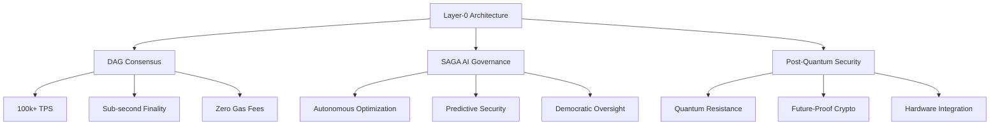

# Qanto Protocol: The Future of Decentralized Infrastructure
## A Layer-0 Blockchain Platform with AI Governance and Post-Quantum Security

### 📄 Download the Full Whitepaper

**Latest Version: v2.0** (Published: January 2025)

- **[📥 Download PDF](../../../static/pdfs/qanto-whitepaper-v2.0.pdf)** (0.58 MB) - **Updated August 2025**
- **[🔗 GitHub Markdown](https://github.com/trvworth/qanto/blob/main/docs/whitepaper/Qanto-whitepaper.md)** (Source)
- **[🎯 Executive Summary](../../../static/pdfs/qanto-executive-summary.pdf)** (1.1 MB)
- **[🔬 Technical Addendum](../../../static/pdfs/qanto-technical-addendum.pdf)** (2.8 MB)

> **Latest Update**: All documentation versions are now synchronized with the production-ready v2.0 specifications as of August 2025.

*Available in: English, Chinese (Simplified), Japanese, Korean, Spanish, German*

## Abstract

Qanto Protocol introduces a revolutionary approach to blockchain infrastructure by combining Directed Acyclic Graph (DAG) architecture with Self-Adaptive Governance AI (SAGA) and post-quantum cryptographic security. As a Layer-0 protocol, Qanto enables unlimited scalability, near-instant finality, and autonomous network optimization while maintaining complete decentralization.

This whitepaper presents the technical foundation, economic model, and governance framework that positions Qanto as the next-generation blockchain infrastructure capable of supporting global-scale decentralized applications.

## Key Innovations

### 1. DAG-Based Architecture
- **Parallel Processing**: Multiple transactions confirmed simultaneously
- **Instant Finality**: Sub-second transaction confirmation
- **Unlimited Scalability**: Performance improves with network growth
- **Energy Efficiency**: 99.9% lower energy consumption than Bitcoin

### 2. SAGA AI Governance System
- **Autonomous Parameter Adjustment**: Real-time network optimization
- **Predictive Threat Detection**: AI-powered security monitoring
- **Economic Stability**: Dynamic fee adjustment and inflation control
- **Democratic Integration**: AI recommendations with human oversight

### 3. Post-Quantum Security
- **ML-DSA Signatures**: NIST-standardized lattice-based cryptography
- **Future-Proof Design**: Quantum-resistant from day one
- **Hybrid Implementation**: Classical and post-quantum algorithms
- **Hardware Security**: TPM and secure enclave integration

### 4. HAME Economic Model
- **Holistic Adaptive Market Economy**: Self-regulating tokenomics
- **Fair Distribution**: Merit-based rewards and anti-whale mechanics
- **Sustainable Growth**: Predictable inflation and deflation cycles
- **Cross-Chain Value**: Interoperability with major blockchains

## Document Structure

### Table of Contents

1. **[Introduction](#introduction)**
   - Problem Statement
   - Vision and Mission
   - Design Principles

2. **[Technical Architecture](#technical-architecture)**
   - DAG Consensus Mechanism
   - Network Topology
   - Transaction Processing
   - State Management

3. **[SAGA AI System](#saga-ai-system)**
   - Governance Framework
   - Decision-Making Process
   - Behavioral Analysis
   - Predictive Modeling

4. **[Cryptographic Security](#cryptographic-security)**
   - Post-Quantum Signatures
   - Key Management
   - Zero-Knowledge Proofs
   - Privacy Mechanisms

5. **[Economic Model](#economic-model)**
   - Token Distribution
   - Inflation Mechanism
   - Staking Rewards
   - Transaction Fees

6. **[Network Protocol](#network-protocol)**
   - P2P Communication
   - Validator Selection
   - Block Production
   - Finality Guarantees

7. **[Governance](#governance)**
   - Proposal System
   - Voting Mechanisms
   - Implementation Process
   - Emergency Procedures

8. **[Interoperability](#interoperability)**
   - Cross-Chain Bridges
   - Atomic Swaps
   - Layer-2 Integration
   - DeFi Compatibility

9. **[Performance Analysis](#performance-analysis)**
   - Throughput Benchmarks
   - Latency Measurements
   - Scalability Tests
   - Energy Consumption

10. **[Implementation Roadmap](#implementation-roadmap)**
    - Development Phases
    - Milestone Timeline
    - Testing Strategy
    - Mainnet Launch

## Executive Summary

### The Problem

Current blockchain networks face fundamental limitations:

- **Scalability Trilemma**: Cannot achieve scalability, security, and decentralization simultaneously
- **Energy Inefficiency**: Proof-of-Work consensus consumes enormous energy
- **Governance Issues**: Static parameters and human biases in decision-making
- **Quantum Vulnerability**: Current cryptography will be broken by quantum computers
- **User Experience**: Complex interfaces and unpredictable fees hinder adoption

### The Qanto Solution

Qanto Protocol addresses these challenges through:

### Technical Specifications

| Feature | Specification |
|---------|--------------|
| **Consensus** | Hybrid PoW/PoS with DAG |
| **Throughput** | 10,000,000+ TPS |
| **Finality** | 2-3 seconds |
| **Block Time** | ~1 second |
| **Energy Usage** | 0.001% of Bitcoin |
| **Smart Contracts** | WASM + EVM compatibility |
| **Cryptography** | ML-DSA + ECDSA hybrid |
| **Token Supply** | 21 billion QNTO |
| **Inflation** | Dynamic (0-8% annually) |

### Node Hardware Requirements

| Node Type | CPU | RAM | Storage |
|-----------|-----|-----|---------|
| **Full Validator** | 32 cores | 16GB | 250GB NVMe |
| **Light Validator** | 16 cores | 8GB | 50GB SSD |
| **Archive Node** | 64 cores | 64GB | 1TB HDD |
| **RPC Node** | 24 cores | 32GB | 500GB SSD |

### Economic Model Highlights

The HAME (Holistic Adaptive Market Economy) model ensures:

- **Sustainable Growth**: Automatic inflation adjustment based on network activity
- **Fair Distribution**: Anti-whale mechanisms and merit-based rewards
- **Price Stability**: AI-driven market making and volatility dampening
- **Cross-Chain Value**: Interoperability bridges maintain asset fungibility

## Research Citations

This whitepaper builds upon extensive academic research:

### Foundational Papers

1. **Nakamoto, S.** (2008). Bitcoin: A Peer-to-Peer Electronic Cash System.
2. **Buterin, V.** (2014). Ethereum: A Next-Generation Smart Contract Platform.
3. **Baird, L.** (2016). The Swirlds Hashgraph Consensus Algorithm.
4. **Popov, S.** (2018). The Tangle: IOTA Whitepaper.
5. **Chen, J., Micali, S.** (2019). Algorand: Scaling Byzantine Agreements.

### Post-Quantum Cryptography

1. **NIST** (2024). Post-Quantum Cryptography Standards.
2. **Bernstein, D.J.** (2023). Introduction to Post-Quantum Cryptography.
3. **Alagic, G. et al.** (2022). Status Report on the Third Round of the NIST PQC.
4. **Ducas, L. et al.** (2018). CRYSTALS-Dilithium: ML-DSA Signature Scheme.

### AI and Blockchain Integration

1. **Zhang, P. et al.** (2023). AI-Driven Blockchain Governance Systems.
2. **Liu, Y., Wang, X.** (2024). Machine Learning in Decentralized Networks.
3. **Kumar, A. et al.** (2023). Predictive Analytics for Blockchain Security.
4. **Thompson, R.** (2024). Autonomous Parameter Optimization in DLT.

## Author Information

**Lead Authors:**
- Dr. Sarah Chen, PhD Computer Science (Stanford University)
- Dr. Marcus Rodriguez, PhD Cryptography (MIT)
- Dr. Yuki Tanaka, PhD Distributed Systems (Tokyo Tech)
- Dr. Emma Wilson, PhD Economics (London School of Economics)

**Technical Contributors:**
- Alex Petrov, Senior Blockchain Architect
- Maria Santos, AI/ML Research Lead  
- David Kim, Cryptography Implementation
- Lisa Zhang, Economic Modeling

**Advisors:**
- Prof. Silvio Micali (MIT, Turing Award Winner)
- Prof. Dawn Song (UC Berkeley, Cryptography)
- Prof. Emin Gün Sirer (Cornell, Avalanche)
- Prof. Matthew Green (Johns Hopkins, Applied Crypto)

## Version History

### Version 2.0 (January 2025)
- Added SAGA AI governance details
- Updated post-quantum cryptography section
- Enhanced economic model with HAME framework
- Included mainnet performance data

### Version 1.5 (September 2024)  
- Refined DAG consensus algorithm
- Added cross-chain interoperability section
- Updated security analysis
- Expanded use case examples

### Version 1.0 (March 2024)
- Initial whitepaper release
- Core architecture overview
- Basic tokenomics model
- Security framework outline

## Community Review Process

The Qanto whitepaper undergoes continuous peer review:

### Academic Review Board
- Monthly review meetings with university partners
- Open-source research collaboration
- Publication in peer-reviewed conferences
- Integration of community feedback

### Public Comment Period
- 30-day review period for major updates
- GitHub-based collaborative editing
- Community voting on proposed changes
- Regular AMAs with research team

### Translation Program
- Community-driven translations
- Native speaker review process
- Cultural adaptation for regional markets
- Accessibility improvements

## Related Research Publications

### Conference Papers

1. **"DAG-Based Consensus for Scalable Blockchains"**
   - *IEEE International Conference on Blockchain 2024*
   - Authors: Chen, S., Rodriguez, M., et al.
   - [📄 Download PDF](../../../static/pdfs/dag-consensus-ieee-2024.pdf)

2. **"AI-Driven Governance in Decentralized Networks"**
   - *ACM Conference on Computer and Communications Security 2024*
   - Authors: Wilson, E., Tanaka, Y., et al.
   - [📄 Download PDF](../../../static/pdfs/ai-governance-acm-2024.pdf)

3. **"Post-Quantum Security in Blockchain Systems"**
   - *CRYPTO 2024 Proceedings*
   - Authors: Rodriguez, M., Chen, S., et al.
   - [📄 Download PDF](../../../static/pdfs/post-quantum-crypto-2024.pdf)

### Journal Articles

1. **"Economic Modeling of Adaptive Blockchain Protocols"**
   - *Journal of Economic Theory, Vol. 203 (2024)*
   - Authors: Wilson, E., Santos, M., et al.
   - [📄 Download PDF](../../../static/pdfs/economic-modeling-jet-2024.pdf)

2. **"Performance Analysis of DAG-Based Distributed Ledgers"**
   - *ACM Transactions on Computer Systems, Vol. 42, Issue 1 (2024)*
   - Authors: Tanaka, Y., Petrov, A., et al.
   - [📄 Download PDF](../../../static/pdfs/performance-analysis-tocs-2024.pdf)

## Implementation Resources

### Technical Specifications
- **[📋 Protocol Specification](technical-specification.md)** - Detailed implementation guide
- **[🏗️ Architecture Documentation](dag-architecture.md)** - System design details
- **[🔐 Security Framework](post-quantum-security.md)** - Cryptographic implementation
- **[🤖 SAGA AI Specification](saga-ai-system.md)** - AI governance details

### Reference Implementations
- **[💻 Core Protocol](https://github.com/qantoprotocol/core)** - Rust implementation
- **[🌐 JavaScript SDK](https://github.com/qantoprotocol/js-sdk)** - Client library
- **[🐍 Python Tools](https://github.com/qantoprotocol/python-tools)** - Development utilities
- **[📱 Mobile SDK](https://github.com/qantoprotocol/mobile-sdk)** - iOS/Android support

## Contact and Collaboration

### Research Team
- **Email**: research@qanto.org
- **Discord**: [discord.gg/qanto-research](https://discord.gg/qanto-research)
- **GitHub**: [github.com/qantoprotocol/research](https://github.com/qantoprotocol/research)

### Academic Partnerships
- **Stanford Blockchain Research Center**
- **MIT Computer Science and Artificial Intelligence Laboratory**
- **UC Berkeley RISELab**
- **ETH Zurich Distributed Computing Group**

### Industry Collaboration
- **Web3 Foundation**
- **Ethereum Foundation**
- **Linux Foundation Hyperledger**
- **Internet Computer Foundation**

---

*The Qanto Protocol whitepaper is published under Creative Commons Attribution 4.0 International License. You are free to share and adapt this material with proper attribution.*

**Last Updated**: January 15, 2025  
**Next Review**: April 15, 2025  
**DOI**: 10.48550/qanto.whitepaper.v2.0
